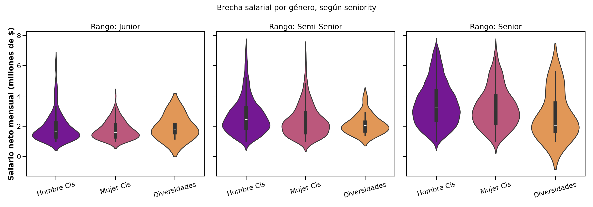
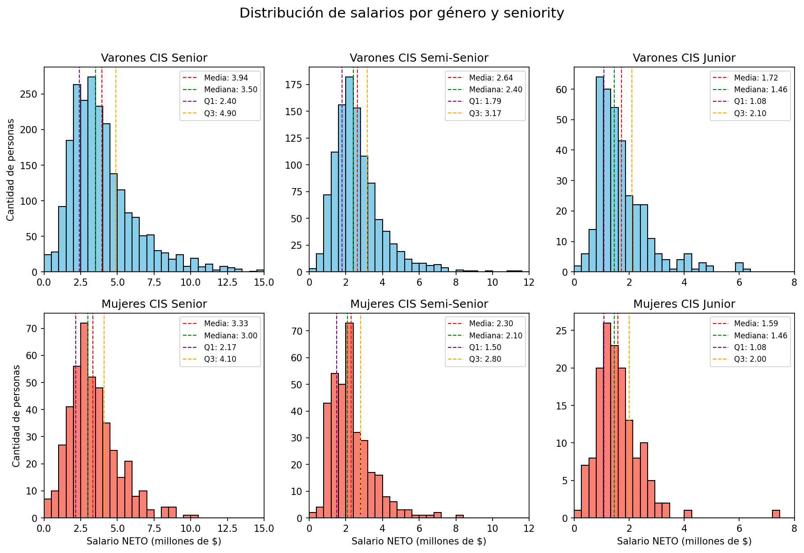
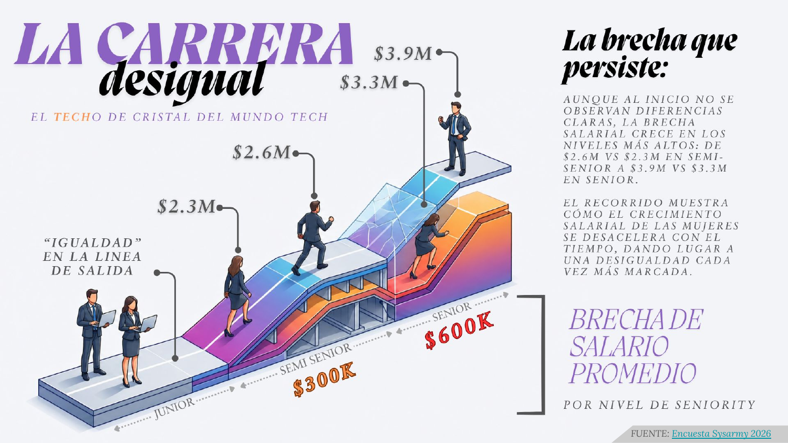

# Brecha salarial en tecnología (Argentina)

Trabajo práctico realizado en el marco de la **Diplomatura en Ciencia de Datos, Aprendizaje Automático y sus Aplicaciones** (Edición 2026) — materia *Análisis y Visualización de Datos*.

Se analiza la encuesta de sueldos [Sysarmy](https://sysarmy.com/blog/posts/resultados-de-la-encuesta-de-sueldos-2024-2/) sobre la industria del software en Argentina, en dos etapas: primero una exploración visual y descriptiva de la base, y luego una validación estadística formal de uno de los hallazgos más relevantes — la brecha salarial de género.

## Autores

Grupo 14:
- María José Kanagusuku
- Nicolás Uriel Mansutti
- Rafael Andrés Pignata
- María Valeria Sieyra

## Fuente de datos

El dataset se carga directamente desde el [repositorio de la Diplomatura](https://github.com/DiploDatos/AnalisisyVisualizacion) ([CSV](https://raw.githubusercontent.com/DiploDatos/AnalisisyVisualizacion/master/sysarmy_survey_2026_processed.csv)); no hace falta descargar nada aparte para reproducir el análisis.

---

## Parte 1 — Análisis exploratorio

**Preguntas abordadas:**
- ¿Cuáles son los lenguajes de programación asociados a los mejores salarios?
- ¿Cómo se relacionan salario, edad, experiencia, seniority y género?
- ¿Existe correlación entre salario bruto y neto? ¿Y entre salario y nivel de estudios?

**Principales hallazgos:**

Los lenguajes mejor pagos son los más populares, no los más raros: JavaScript, Python y SQL concentran los salarios más altos.

El salario escala con el seniority:


Y aparece una brecha de género que se sostiene incluso controlando por seniority:




📓 Notebook completo: [`parte1_analisis_exploratorio/notebook.ipynb`](parte1_analisis_exploratorio/notebook.ipynb)

---

## Parte 2 — Inferencia estadística y comunicación

La Parte 1 detectó la brecha de género visualmente. Acá se pone a prueba con herramientas estadísticas formales, para poder afirmar (o no) que la diferencia es real y no producto del azar de la muestra.

**Estimación puntual e intervalo de confianza (95%)** para la diferencia de salario neto promedio (varones − mujeres), por nivel de seniority:

| Seniority | Diferencia estimada | IC 95% |
|---|---|---|
| Senior | ~$609.000 | [$428.588, $789.831] |
| Semi-Senior | ~$340.000 | IC no incluye 0 |
| Junior | ~$130.000 | IC incluye 0 (no significativo) |

**Test de hipótesis (Welch t-test)** para $H_0: \mu_{varones} - \mu_{mujeres} = 0$:

- **Senior:** t = 6.61, p = 7.07 × 10⁻¹¹ → se **rechaza** H₀.
- **Semi-Senior:** diferencia significativa → se **rechaza** H₀.
- **Junior:** no hay evidencia suficiente para rechazar H₀.



**Control de robustez:** se repitió el análisis filtrando solo dedicación Full-Time (aproximadamente el 96% de la muestra), para descartar que la brecha se explique por diferencias en la carga horaria. El resultado se mantuvo prácticamente igual ($~\$$597.000 en Senior, $~\$$334.000 en Semi-Senior, no significativo en Junior), lo que refuerza que la brecha no se explica por dedicación laboral.

**Comunicación:** como cierre, se diseñó una pieza de comunicación de datos para audiencia no técnica, resumiendo el hallazgo principal en un formato visual.



📓 Notebook completo: [`parte2_inferencia_estadistica/notebook.ipynb`](parte2_inferencia_estadistica/notebook.ipynb)
📄 Infografía en PDF: [`parte2_inferencia_estadistica/comunicacion/la_carrera_desigual.pdf`](parte2_inferencia_estadistica/comunicacion/la_carrera_desigual.pdf)

---

## Herramientas y metodología

- **Limpieza y estadística descriptiva:** filtrado por percentiles, medidas de centralización y dispersión por subpoblación.
- **Visualización:** histogramas, boxplots, violin plots con `seaborn` y `matplotlib`.
- **Inferencia estadística:** intervalos de confianza para diferencia de medias, test t de Welch (`scipy.stats`), análisis de robustez por subgrupos.
- **Comunicación de datos:** diseño de una pieza visual para audiencia no técnica.

Librerías: `pandas`, `numpy`, `matplotlib`, `seaborn`, `scipy`.

## Estructura del repositorio

```
.
├── README.md
├── requirements.txt
├── parte1_analisis_exploratorio/
│   ├── notebook.ipynb
│   └── images/
│       ├── salario_vs_seniority.png
│       ├── salario_vs_genero.png
│       └── brecha_genero_por_seniority.png
└── parte2_inferencia_estadistica/
    ├── notebook.ipynb
    ├── images/
    │   └── distribucion_salarios_genero_seniority.png
    └── comunicacion/
        ├── la_carrera_desigual.pdf
        └── infografia.png
```

## Cómo reproducirlo

```bash
pip install -r requirements.txt
jupyter notebook
```

Ambos notebooks descargan los datos automáticamente desde la URL indicada arriba; no requieren ningún archivo local.
