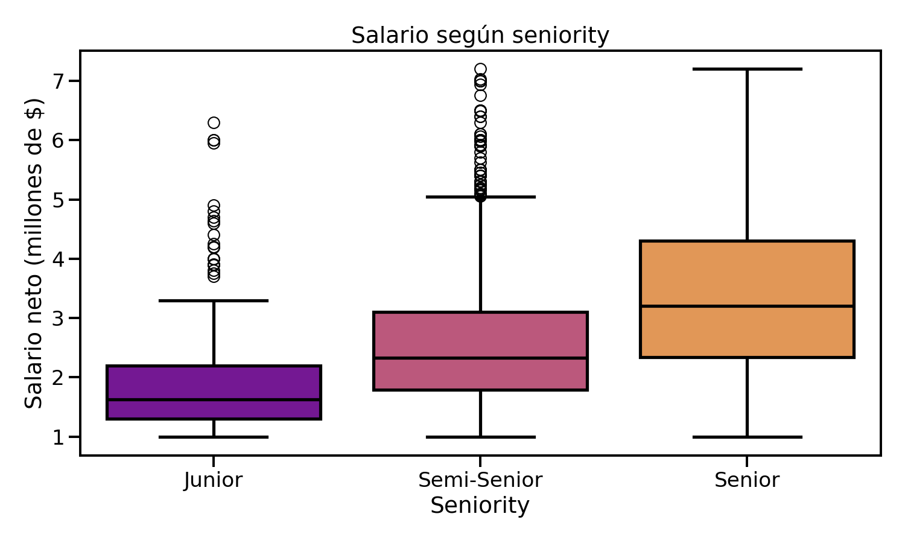
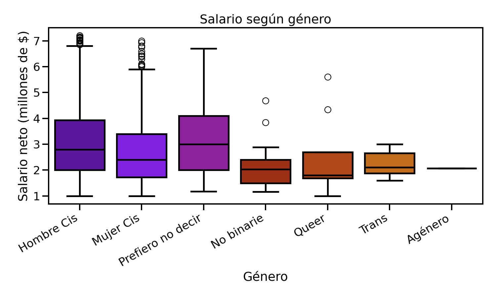

# Análisis exploratorio de salarios en tecnología (Argentina)

Trabajo práctico realizado en el marco de la **Diplomatura en Ciencia de Datos, Aprendizaje Automático y sus Aplicaciones** (Edición 2026) — materia *Análisis y Visualización de Datos*, Entregable 1.

Se analiza la encuesta de sueldos [Sysarmy](https://sysarmy.com/blog/posts/resultados-de-la-encuesta-de-sueldos-2024-2/) sobre la industria del software en Argentina, con el objetivo de describir la base desde distintos ángulos, explorar relaciones entre variables y plantear hipótesis sobre los factores asociados a mejores salarios.

## Autores

Grupo 14:
- María José Kanagusuku
- Nicolás Uriel Mansutti
- Rafael Andrés Pignata
- María Valeria Sieyra

## Fuente de datos

El dataset se carga directamente desde el [repositorio de la Diplomatura](https://github.com/DiploDatos/AnalisisyVisualizacion) ([CSV](https://raw.githubusercontent.com/DiploDatos/AnalisisyVisualizacion/master/sysarmy_survey_2026_processed.csv)), por lo que no es necesario descargar ningún archivo adicional para reproducir el análisis.

## Preguntas abordadas

**Ejercicio 1 — Análisis descriptivo:** ¿cuáles son los lenguajes de programación asociados a los mejores salarios?

**Ejercicio 2 — Densidades y relaciones entre variables:**
- Distribución conjunta de salario, edad, experiencia, seniority y género.
- Correlación entre salario bruto y neto.
- Densidad condicional del salario según nivel de estudios.
- Relación entre salario, edad y seniority.

## Principales hallazgos

**Los lenguajes mejor pagos son los más populares, no los más raros.** JavaScript, Python y SQL concentran los salarios más altos: el 50% de quienes los usan cobra un neto de $6.4M o más por mes.

**El salario escala con el seniority, con overlaps esperables entre niveles.**



**Existe una brecha salarial de género que se sostiene incluso controlando por seniority.** Los hombres cis cobran sistemáticamente más que otros géneros, y la diferencia persiste dentro de cada nivel de jerarquía (más marcada en Semi-Senior y Senior que en Junior).




**El nivel de estudios no es independiente del salario.** Quienes tienen formación universitaria tienen mayor probabilidad de superar el salario promedio que quienes tienen formación terciaria; de hecho, la mediana de los universitarios supera al percentil 75 de los terciarios.

**Salario bruto y neto están fuertemente correlacionados** (Pearson ≈ 1), con algunos outliers explicables por regímenes impositivos distintos (ej. monotributo vs. relación de dependencia).

## Herramientas y metodología

- **Limpieza de datos:** filtrado por percentiles (5%-95%) para salarios, remoción de inconsistencias (netos mayores a brutos, edades imposibles).
- **Estadística descriptiva:** medidas de centralización y dispersión por subpoblación.
- **Visualización:** histogramas, boxplots, violin plots y scatterplots con `seaborn` y `matplotlib`.
- **Análisis de asociación:** coeficiente de correlación de Pearson.

Librerías: `pandas`, `numpy`, `matplotlib`, `seaborn`.

## Estructura del repositorio

```
.
├── README.md
├── notebook.ipynb
├── requirements.txt
└── images/
    ├── salario_vs_seniority.png
    ├── salario_vs_genero.png
    └── brecha_genero_por_seniority.png
```

## Cómo reproducirlo

```bash
pip install -r requirements.txt
jupyter notebook notebook.ipynb
```

El notebook descarga los datos automáticamente desde la URL indicada arriba; no requiere ningún archivo local.

# salarios-devs-argentina-analisis-exploratorio
EDA de sueldos en tecnología (Argentina): salario vs. seniority, género, lenguajes y educación.
